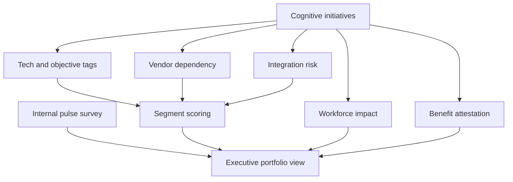

# Cognpulse

**Source:** `ai-in-enterprise/deloitte-us-da-2017-deloitte-state-of-cognitive-survey/`
**Domain:** `ai-enterprise`
**One-liner:** A first-wave cognitive initiative pulse and portfolio for cognitive-active enterprises that tracks technology mix, objectives, benefits, workforce impact, and Fast/Slow/Wader maturity segments — so bullish early adopters build institutional capability without confusing enthusiasm for transformation.
**Wedge:** US enterprises ≥500 employees (often 5,000+) with cognitive-aware executives who have started cognitive projects but still face fragmented vendors, talent shortage, and internal-only use cases — the 2017 Deloitte State of Cognitive Survey cohort profile.
**Positioning:** First-edition cognitive adoption pulse and portfolio. Distinct from Triara (2018 “get serious” risk/cyber/talent gates), Adoptra (5As behavioural adoption), Alloyra (tech-vendor productisation), and Operum (intelligent ops towers). Cognpulse encodes the 2017 bellwether findings: 87% say cognitive is important to products/services, 92% to internal processes, 76% expect substantial company transformation within three years — while integration challenges, vendor fragmentation, and mostly internal focus remain the binding constraints. Segments Fast Lane / Slow Lane / Waders drive differentiated playbooks.

## Market research synthesis

### Thesis from source

The 2017 Deloitte State of Cognitive Survey asked whether cognitive/AI capabilities were having measurable impact. From 1,500 senior US executives screened down to 250 “cognitive-aware” leaders in “cognitive-active” companies (≈17%), 72% C-level, across technology/media/telecom (29%), consumer/industrial (24%), and financial services (20%). These early adopters are bullish: cognitive technologies matter to offerings and processes; 76% expect substantial company transformation within three years. When integrated into workflows, cognitive systems influence tasks, decisions, interactions, and outcomes.

Yet maturity is uneven. The vendor landscape is fragmented; talent is short; many initiatives focus on internal functions rather than new products or customer interactions; integration with existing systems is a principal challenge. Workforce impact is largely positive so far — most report added cognitive-related jobs or little/no job loss, with only a moderate uptick expected in job loss over three years — but executives split on how transformative the wave will be. The report recommends a **portfolio approach**: exploit early opportunities to build capabilities and institutional support while also pursuing transformational innovation on selected products, processes, or business models.

Segmentation matters: more aggressive “Fast Lane” respondents implemented more projects, spent more, used more sophisticated technologies (including deeper ML/NLP/deep learning), and were most positive. “Slow Lane” still saw moderate benefits. “Waders” (~¼ of sample) relied heavily on vendors (~80% single or multiple vendors; only 5% build their own), leaning on gateway technologies such as RPA and rules-based systems (usage figures in the mid-40s to 70s% by segment) while lagging on complex AI. Cognpulse makes segment, technology mix, objective balance (internal vs customer/product), integration risk, and workforce impact first-class portfolio objects.

### Buyer & economic model

- **Primary buyer:** CIO or Head of Innovation / Cognitive programme lead in a cognitive-active enterprise.
- **Users:** Initiative owners; enterprise architects (integration); HR/workforce planners; vendor managers; finance.
- **Budget owner / value metric:** Cognitive/AI programme budget. Value metric is *balanced portfolio health* (capability-building vs transformational bets; internal vs customer-facing share) and *segment progression* (Wader→Slow→Fast indicators) — not vanity project count.
- **Competing status quo:** Annual strategy surveys in PowerPoint; project lists in PPM without technology taxonomy; HR headcount plans disconnected from automation narratives.

### Domain constraints

- **Regulatory / trust / safety:** Workforce claims and automation narratives may trigger labour consultation; customer-facing cognitive features inherit sector rules.
- **Data sensitivity:** Segment labels on business units can become political; vendor performance comparisons are sensitive.
- **Change-management realities:** Bullish executives over-weight transformation timelines; Wader teams hide on RPA and call it AI; Fast Lane teams under-invest in institutional support while chasing sophistication.

## Business requirements

- BR-1: Every cognitive initiative records technology classes (RPA, rules, ML, NLP/G, speech, computer vision, deep learning, robotics) and primary objective (internal efficiency, decision support, customer interaction, new product).
- BR-2: Portfolio policy requires a minimum share of transformational or customer/product bets alongside capability-building internals.
- BR-3: Integration risk with systems of record is scored before implementation funding.
- BR-4: Vendor dependency (single, multi, in-house) is tracked; Wader-pattern over-dependency triggers a capability-building plan.
- BR-5: Organisational units receive Fast/Slow/Wader segment scores from transparent indicators (spend, project count, tech sophistication, outcome positivity).
- BR-6: Workforce impact (jobs added, unchanged, moderate loss expected) is recorded per initiative and rolled up.
- BR-7: Benefits achieved (substantial/moderate/none) are periodically re-attested, not one-time survey answers.
- BR-8: Talent shortage risks are flagged when sophisticated tech classes lack named skills coverage.
- BR-9: Vendor landscape map links initiatives to providers to expose fragmentation cost.
- BR-10: Executive pulse surveys can be run internally and compared to external bellwether benchmarks (e.g. 76% transformation expectation).
- BR-11: Kill/complete decisions feed institutional learning for the portfolio approach.
- BR-12: Audit trail retains segment methodology versions so historical scores remain interpretable.

## User stories

Canonical user stories live in sibling [USER_STORIES.md](USER_STORIES.md).

## System design

### Overview

Cognpulse combines an initiative portfolio (taxonomy, objectives, vendors, integration risk, benefits, workforce impact) with an internal pulse engine and segment scoring. Playbooks differ by segment. Executive views compare internal pulse to published bellwether benchmarks.

### Actors & boundaries

- **Actors:** Programme lead, CIO, initiative owners, HR, vendor managers, architects, finance.
- **Trust boundary:** Segment scores and workforce data restricted; vendor scorecards limited to procurement+programme.
- **Human-in-the-loop points:** Segment methodology changes, benefit attestation, portfolio policy exceptions.

### Core capabilities

1. Cognitive initiative register
2. Technology and objective taxonomy
3. Vendor dependency map
4. Integration risk scoring
5. Segment scoring (Fast/Slow/Wader)
6. Workforce impact tracking
7. Benefit attestation
8. Internal pulse surveys
9. Portfolio policy engine
10. Governance and methodology versioning

### Conceptual data

- **Primary entities:** CognitiveInitiative, TechnologyTag, ObjectiveType, VendorLink, IntegrationRisk, SegmentScore, WorkforceImpact, BenefitAttestation, PulseSurvey, PortfolioPolicy, AuditEntry.
- **Critical events:** initiative registered; risk scored; segment refreshed; benefit attested; pulse closed; policy exception granted.
- **Retention / audit needs:** Methodology versions and attestations retained for multi-year comparison to external surveys.

### Integrations (conceptual)

- **Systems of record:** PPM; HRIS; vendor management; enterprise architecture CMDB.
- **Upstream signals:** Project status, hiring, vendor invoices.
- **Downstream actions:** Playbook assignments, consolidation programmes, board pulses.

### High-level architecture

### Success metrics

- **Leading:** Share of customer/product-oriented bets; integration risks closed before build; pulse response rate.
- **Lagging:** Segment progression; benefit attestation vs initial bullishness; vendor consolidation; workforce narrative accuracy.

## OpenAPI skeleton

Canonical HTTP surface lives in sibling `openapi.yaml`. Summarize here:

- **Base path:** `/v1/...`
- **Auth:** `ApiKeyAuth` for PPM/HRIS/vendor feeds; `BearerAuth` for programme, CIO, HR operators.
- **Resource groups:** Initiatives, Technologies, Vendors, Segments, Workforce, Pulse, Portfolio, Governance.
