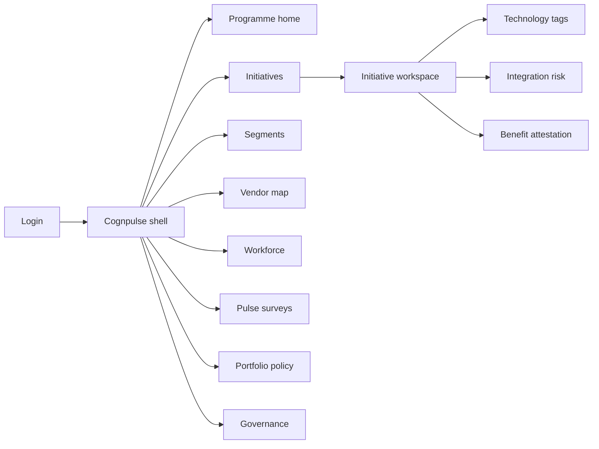
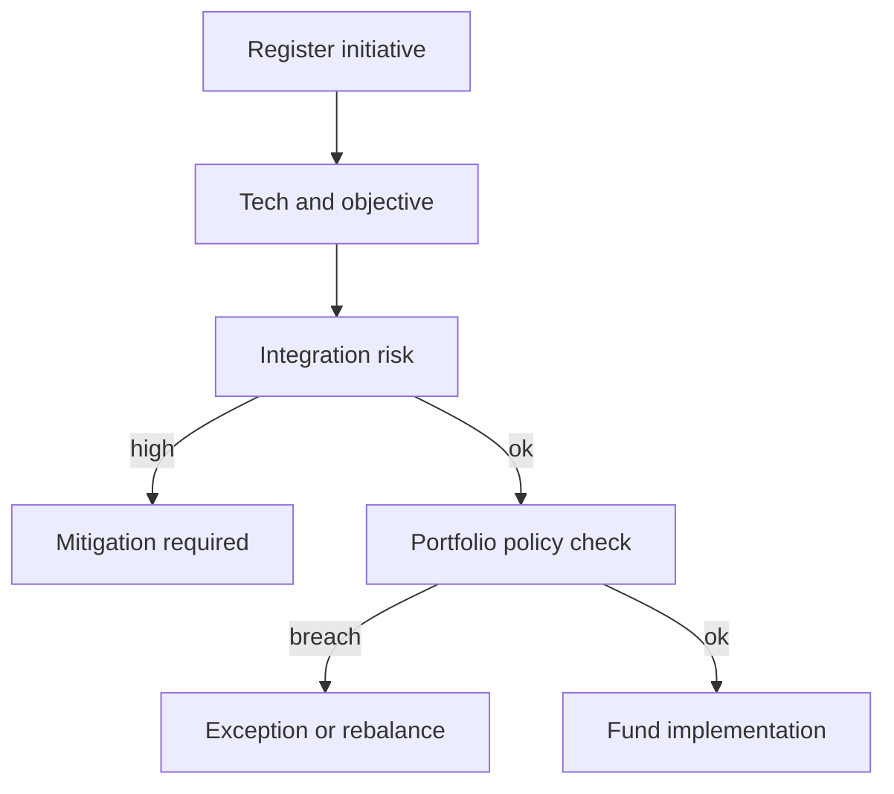

# Cognpulse — Web app

**Product:** [PRODUCT.md](./PRODUCT.md)
**Primary surface:** Cognitive programme pulse console (CIO / innovation programme shell)
**Secondary surfaces:** Internal pulse survey respondent UI; executive benchmark briefing (read-only)
**Design thesis:** Cognpulse is a radar for first-wave cognitive programmes — enthusiasm measured against portfolio balance, not a model factory. The UI metaphor is a maturity pulse: Fast Lane / Slow Lane / Wader segments sit as lane markers, technology mix as a stacked spectrum (RPA→deep learning), and benefit attestations as timed re-checks of bullish claims. Visual language is cool indigo-slate ink on soft fog panels with lane-amber for Wader dependency warnings and signal-cyan for Fast Lane sophistication — never a purple “AI transformation” gradient that confuses survey optimism with shipped change.

## UX research synthesis

### Category peers (best-in-class)

- **ServiceNow Strategic Portfolio Management:** Demand → project → outcome with policy gates. Steal: portfolio policy banners when internal-only share exceeds threshold; reject ITIL ticket aesthetics as the cognitive home.
- **Gartner Digital Execution Scorecard / Peer Insights style pulse UIs:** Benchmark your org vs published cohort. Steal: internal pulse vs external bellwether (e.g. 76% transformation expectation) as a paired chart; reject paywalled report PDFs as the only deliverable.
- **WalkMe / Whatfix Digital Adoption (enterprise):** Adoption health by segment with playbook nudges. Steal: segment-specific playbook assignment (Wader enablement vs Fast Lane governance); reject consumer-y celebration confetti for workforce impact.
- **LeanIX / Ardoq (EA):** Application and integration risk maps. Steal: integration risk as a funding blocker with CMDB-linked systems; reject full EA graph exploration as v1 home.

### Patterns to adopt / reject

- **Adopt:** Tech-class + objective tags on every initiative; Fast/Slow/Wader scores with transparent indicators; vendor dependency heat; workforce impact rollups; periodic benefit re-attestation; pulse vs bellwether; portfolio policy for transformational share.
- **Reject:** Vanity project-count dashboards; “AI maturity” single score without methodology version; hiding Wader RPA-as-AI; HR headcount scare walls; chatbot as programme manager; purple insight panels.

### Trust, density, and workflow constraints from PRODUCT.md

Segment labels are political (domain constraints): methodology must be versioned and visible (BR-12). Workforce narratives need labour-safe language and evidence (BR-6). Integration risk blocks funding (BR-3). Wader over-dependency triggers capability plans, not more licenses (BR-4). Benefits are re-attested, not frozen survey answers (BR-7). Portfolio policy enforces customer/product share (BR-2).

## Information architecture

### Nav model

### Roles → default home

| Role | Default home | Why |
|------|--------------|-----|
| Cognitive programme lead | Programme home — balance + segments | Detect internal-RPA over-index (BR-1, BR-2) |
| CIO | Programme home — integration risk queue | Block unfundable integrations (BR-3) |
| Initiative owner | Initiative workspace | Attest benefits; know lane (BR-7) |
| HR / workforce lead | Workforce | Jobs-added vs loss narrative (BR-6) |
| Vendor manager | Vendor map | Fragmentation and Wader dependency (BR-4, BR-9) |
| Enterprise architect | Integration risk queue | Systems-of-record coupling |
| Audit / methodology owner | Governance | Segment methodology versions (BR-12) |

### Cross-links to OpenAPI resources

| Nav area | OpenAPI tags / resources |
|----------|---------------------------|
| Initiatives | Initiatives |
| Technology tags | Technologies |
| Vendor map | Vendors |
| Segments | Segments |
| Workforce | Workforce |
| Pulse surveys | Pulse |
| Portfolio policy | Portfolio |
| Audit entries | Governance |

## Screen inventory

### Programme home

- **Purpose:** One composition: portfolio balance (internal vs customer/product), segment distribution, top integration risks, pulse vs bellwether.
- **Entry:** Default for programme lead / CIO.
- **Layout regions:** Brand + period; balance gauges vs policy; Fast/Slow/Wader distribution; risk queue preview; pulse delta vs published benchmark; alerts (attestation overdue, talent gaps).
- **Primary actions:** Open initiative; run/view pulse; adjust policy; export exec briefing.
- **Empty / loading / error:** Empty = register first cognitive initiative + tech tags; loading = skeleton gauges; error = retry with request id.
- **BR / story ties:** BR-2, BR-5, BR-10.

### Initiative list

- **Purpose:** Taxonomised register of cognitive initiatives with tech and objective filters.
- **Entry:** Nav → Initiatives.
- **Layout regions:** Filterable table (tech classes, objective, vendor pattern, benefit status, segment of owning unit); kill/complete markers.
- **Primary actions:** Create initiative; bulk tag; open workspace.
- **Empty / loading / error:** Empty = objective-type starter templates.
- **BR / story ties:** BR-1, BR-11.

### Initiative workspace

- **Purpose:** Single initiative truth: taxonomy, risk, vendors, workforce, attestations, lane.
- **Entry:** From list or home.
- **Layout regions:** Header (objective, lane capability vs transformational); tech spectrum chips; vendor dependency; integration risk score; workforce impact; latest benefit attestation; kill/complete.
- **Primary actions:** Update tags; score risk; attest benefits; request policy exception.
- **Empty / loading / error:** Missing tech/objective = blocking completeness banner.
- **BR / story ties:** BR-1, BR-3, BR-6, BR-7.

### Technology tagging

- **Purpose:** Explicit RPA/rules/ML/NLP/speech/CV/deep learning/robotics mix — stop calling RPA “AI.”
- **Entry:** Initiative → Technologies.
- **Layout regions:** Multi-select tech classes; sophistication hint vs segment; talent-coverage warning when deep classes lack skills (BR-8).
- **Primary actions:** Save tags; flag talent gap.
- **Empty / loading / error:** None selected = cannot save as complete.
- **BR / story ties:** BR-1, BR-8.

### Integration risk

- **Purpose:** Score coupling to systems of record before funding.
- **Entry:** Initiative workspace; CIO risk queue.
- **Layout regions:** Risk factors; linked CMDB systems; mitigation plan; fund-block banner when high.
- **Primary actions:** Score; attach mitigation; clear for funding.
- **Empty / loading / error:** Unscored = treated as blocked for funding.
- **BR / story ties:** BR-3; CIO stories.

### Vendor map

- **Purpose:** Expose fragmentation and single/multi/in-house dependency patterns by segment.
- **Entry:** Nav → Vendors.
- **Layout regions:** Provider graph/table linked to initiatives; dependency pattern badges; Wader over-dependency callouts with capability-plan CTA.
- **Primary actions:** Link vendor; open consolidation candidate; launch enablement plan.
- **Empty / loading / error:** Empty = prompt to import vendor list.
- **BR / story ties:** BR-4, BR-9.

### Segment scores

- **Purpose:** Transparent Fast/Slow/Wader scoring per organisational unit with indicator breakdown.
- **Entry:** Nav → Segments.
- **Layout regions:** Unit list with lane badge; indicator panel (spend, project count, tech sophistication, outcome positivity); methodology version stamp; playbook assignment.
- **Primary actions:** Refresh scores; open playbook; drill to contributing initiatives.
- **Empty / loading / error:** Insufficient data = “Wader provisional” with explanation.
- **BR / story ties:** BR-5, BR-12.

### Workforce impact

- **Purpose:** Jobs added / unchanged / moderate loss expected — honest rollup without scare theatre.
- **Entry:** Nav → Workforce; initiative detail.
- **Layout regions:** Initiative-level records; org rollup; narrative guardrails copy; three-year moderate-loss note.
- **Primary actions:** Record impact; export for labour consultation pack.
- **Empty / loading / error:** Missing impact = attestation incomplete.
- **BR / story ties:** BR-6; HR stories.

### Benefit attestation

- **Purpose:** Periodic re-check of substantial/moderate/none benefits — kill survey fossilization.
- **Entry:** Initiative; attestation queue on home.
- **Layout regions:** Prior claim vs new attestation; evidence links; due date.
- **Primary actions:** Attest; defer with reason; escalate under-delivery.
- **Empty / loading / error:** Overdue = amber queue item.
- **BR / story ties:** BR-7.

### Pulse surveys

- **Purpose:** Run internal executive pulses and compare to external bellwether benchmarks.
- **Entry:** Nav → Pulse surveys; respondent deep link.
- **Layout regions:** Survey builder (cognitive importance, transformation expectation, etc.); response progress; results vs benchmark band; close survey control.
- **Primary actions:** Launch; close; publish exec comparison.
- **Empty / loading / error:** Closed survey = read-only results; low response = warning.
- **BR / story ties:** BR-10.
- **Mobile notes:** Respondent UI must work on phone for C-level completion.

### Portfolio policy

- **Purpose:** Enforce minimum transformational / customer-product share beside capability internals.
- **Entry:** Nav → Policy.
- **Layout regions:** Thresholds; current vs target; exception log; affected initiatives.
- **Primary actions:** Edit policy; grant exception (audited).
- **Empty / loading / error:** Breach = coral banner on programme home.
- **BR / story ties:** BR-2.

### Governance

- **Purpose:** Methodology versions for segments and audit of kill/complete and exceptions.
- **Entry:** Nav → Governance.
- **Layout regions:** Methodology version list; audit entries; historical score interpretability notes.
- **Primary actions:** Publish methodology version; export audit.
- **Empty / loading / error:** Unversioned change blocked.
- **BR / story ties:** BR-11, BR-12.

## Key flows

1. **Register and fund initiative** — create → tag tech/objective → score integration risk → check portfolio policy → fund; failure: high integration risk or policy breach blocks.

2. **Segment refresh and playbook** — indicators refresh → Fast/Slow/Wader → assign playbook; Wader vendor dependency → capability plan (BR-4, BR-5).

3. **Benefit re-attestation cycle** — due reminder → attest substantial/moderate/none → portfolio health updates (BR-7).

4. **Internal pulse vs bellwether** — launch survey → close → compare to published benchmarks → exec briefing (BR-10).

5. **Kill/complete learning** — decision → learning note → audit retain (BR-11).

## Design system

### Tokens (CSS variables)

- `--color-ink: #1B2433` — primary text
- `--color-fog: #EEF1F5` — app ground
- `--color-panel: #FFFFFF` — panels
- `--color-rule: #C9D0DA` — dividers
- `--color-cyan: #1A8F9C` — Fast Lane / signal positive
- `--color-amber: #D4891A` — Slow / provisional attestation
- `--color-coral: #C4574A` — Wader dependency / policy breach / fund block
- `--color-slate: #4A5A6A` — secondary
- `--color-brand: #1A8F9C` — Cognpulse wordmark
- `--font-display: "Fraunces", serif` — programme titles and segment names
- `--font-body: "DM Sans", sans-serif` — chrome and tables
- `--font-mono: "DM Mono", monospace` — methodology versions, survey ids
- `--space-1`…`--space-8`: 4px scale
- `--radius-sm: 4px`; `--radius-md: 8px`
- `--motion-pulse: 280ms ease-in-out` — pulse gauge update
- `--motion-lane: 200ms ease-out` — segment badge change
- `--motion-attest: 180ms ease-out` — attestation confirm
- Atmosphere: soft fog radial wash; subtle lane stripes in segment views; no neural-net stock art.

### Typography & brand

- Display for programme and segment labels; body for dense portfolio tables; mono for methodology versions.
- Brand in shell on every portfolio-bearing screen; login hero: brand + “Pulse cognitive programmes, not project counts” + one CTA.

### Do / don’t

- **Do:** Show tech mix spectrum; version segment methodology; re-attest benefits; pair pulse with bellwether; treat Wader dependency as enablement cue.
- **Don’t:** Single vanity maturity dial; purple AI marketing gradients; hide RPA-heavy portfolios; scare-only workforce UI; card walls of unrelated KPIs.

### Accessibility & domain trust cues

- Lane colours always paired with text labels (Fast / Slow / Wader).
- Live regions for attestation due and policy breach.
- Workforce exports use consultation-safe phrasing templates.
- Focus order: initiative completeness → risk → policy → fund.

## Component patterns

- **TechSpectrumChips** — RPA through deep learning multi-tag.
- **ObjectiveLaneBadge** — internal capability vs transformational/customer.
- **SegmentLaneMeter** — Fast/Slow/Wader with indicator breakdown.
- **VendorDependencyHeat** — single/multi/in-house with fragmentation cost.
- **IntegrationRiskBanner** — fund-blocking state.
- **BenefitAttestationCard** — prior vs new with due state (interaction container).
- **PulseVsBellwether** — internal vs published benchmark pair.
- **PortfolioPolicyGauge** — transformational share vs threshold.
- **WorkforceImpactRollup** — jobs added/unchanged/moderate loss.

## Out of scope for v1 web

- Model training or MLOps consoles; full EA modeling suites; HRIS payroll systems; public anonymous industry survey hosting for other firms; native mobile programme apps beyond pulse respondent; consulting white-label multi-tenant portals.
